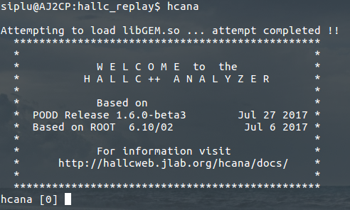

hcana_gem - Analyze SHMS Active Sieve slit data
===============================================

This is the GEM detector library which is used to analyze GEM data that is part of the SHMS data. It can can used with ```hcana``` as a shared library or as an independent executable program.

Dependency
----------

- To use with ```hcana```, first install and compile an up to data copy of hcana and source the ```setup.sh``` or ```setup.csh``` script in ```hcana```. Setup instruction for ```hcana``` can be found [here][1] and [here][2]. You will also need a copy of ```hallc_replay``` which can be found [here][3].

Compilation and Setup
---------------------
- To compile the GEM analysis code, from the top level directory of the repository do:
```
make
```
- This will build a module ```libGEM.so``` inside the directory ```lib/```. Source the file ```thishcana_gem.sh``` (for bash) or ```thishcana_gem.csh``` (for c-shell). To make the sourcing permanent it is convenient to put the following lines in your ```.bashrc``` file (for bash):

```
if [ -f /path/to/thishcana_gem.sh ]; then 
    source /path/to/thishcana_gem.sh
fi 
```

- To load the shared library ```libGEM.so``` automatically every time you start ```hcana``` for ```hallc_replay```, just copy the file ```rootlogon.C``` to the top level directory of ```hallc_replay``` (or to our working directory).  Now start ```hcana``` form the top level directory of ```hallc_replay```. You will see the following typical ```hcana``` start-up screen with an additional line on the top confirming if ```libGEM.so``` has been loaded successfully:



- Another way to load the library from the analysis script is to put the following line at the beginning of the script:
```
R__LOAD_LIBRARY(libGEM.so);
```

Doing the Analysis
-------------------
The GEM detector configuration is set from the script ```config/gem_hcna.cfg```. To do an analysis that includes the GEM, add the following to the typical replay script, correcting paths and spectrometer apparatuses as needed:
```
  THcGEM* gem = new THcGEM("gem","GEM data");
  gem->SetConfigFile("/path/to/gem_hcana.cfg");
  SHMS->AddDetector(gem);
```
Also you need to add ```block P.gem.*``` to the ```pstackana_production.def``` file (this file is located under ```hallc_replay``` at ```DEF-files/SHMS/PRODUCTION/```) so that the GEM data shows up in the ```TTree``` with other SHMS data.

You can try running the example scripts inside the directory ```examples/```.


Running as an Executable
-------------------------
To compile the library as an independent executable that provides access to GEM data only (useful for testing GEM), use the other ```Makefile``` named ```MakefileExe``. Change the include and library path as required and compile as:
```
make -f MakefileExe
```
The executable requires the ```EVIO``` library installed and sourced. Instruction for EVIO library can be found [here][4]. 


[1]:https://github.com/JeffersonLab/hcana
[2]:https://hallcweb.jlab.org/wiki/index.php/ROOT_Analyzer/Git
[3]:https://github.com/JeffersonLab/hallc_replay
[4]:https://coda.jlab.org/drupal/content/event-io-evio